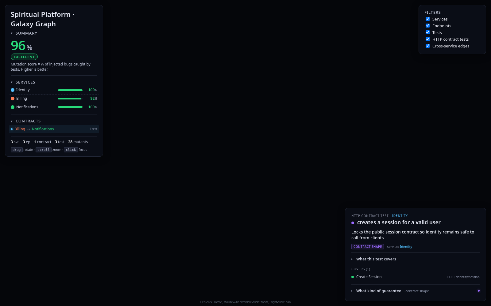
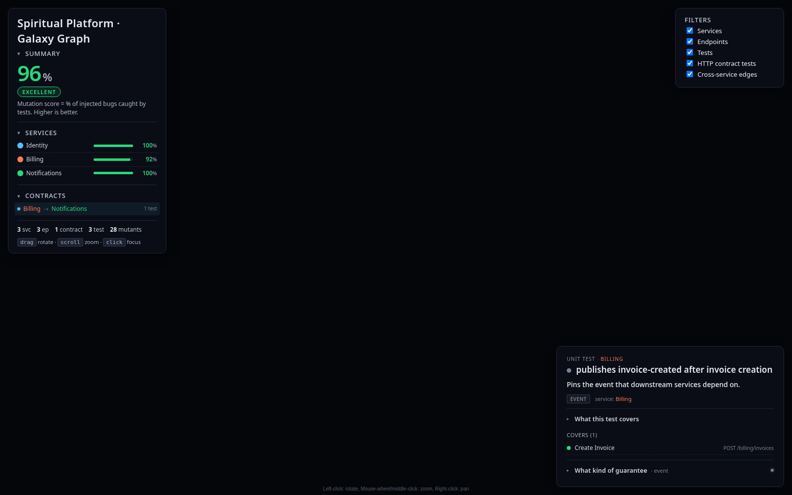
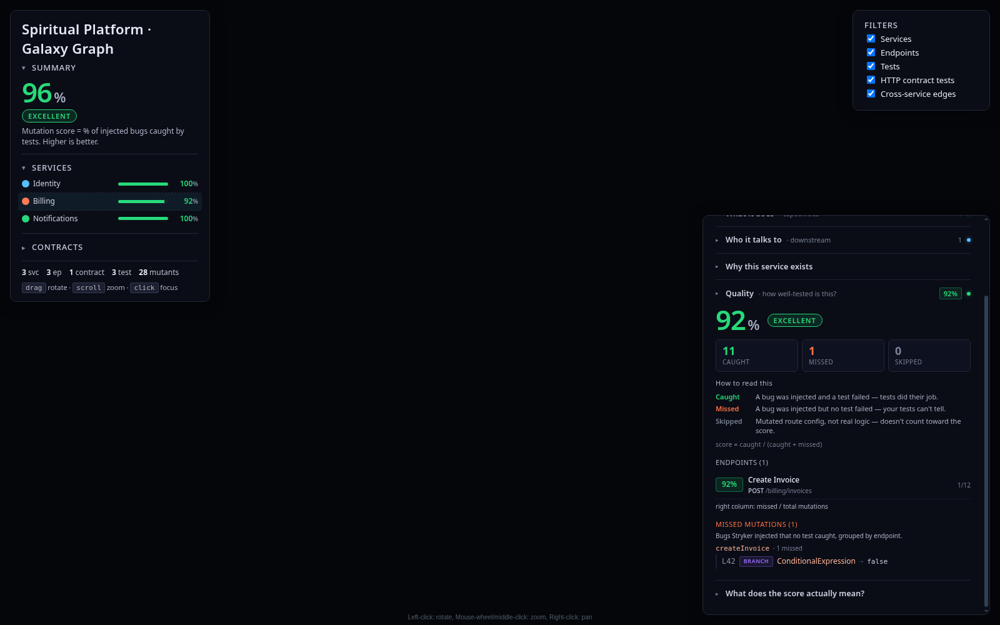
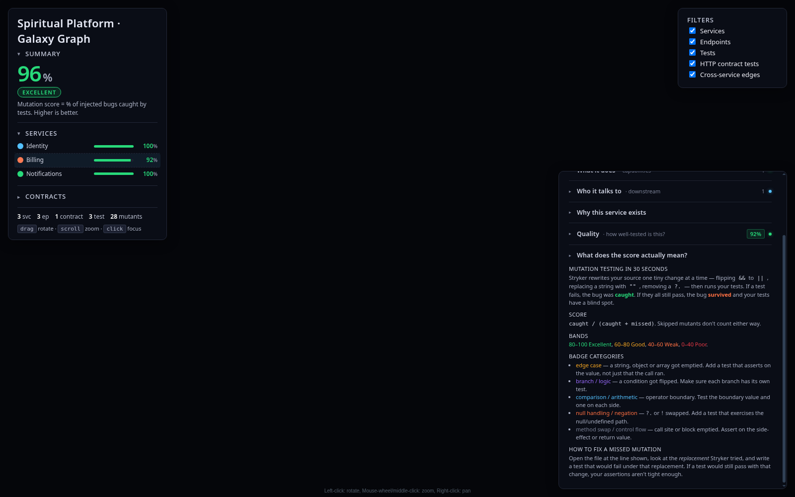
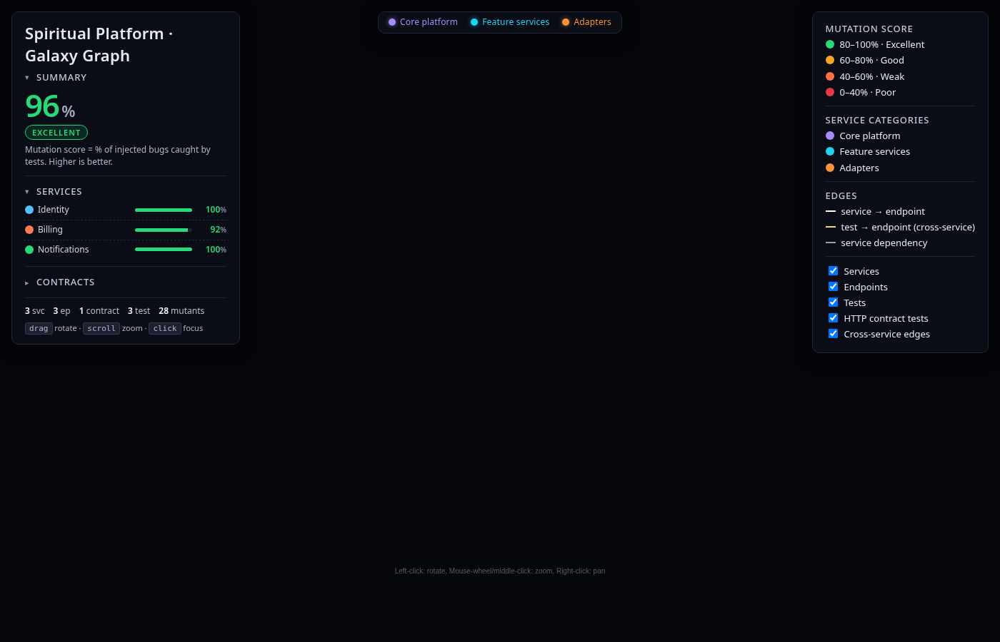
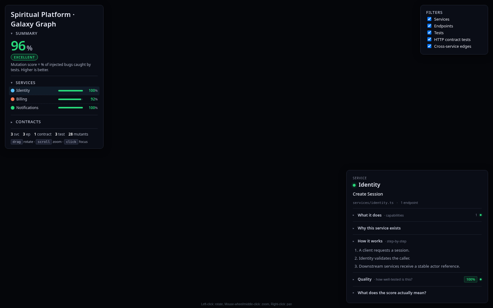
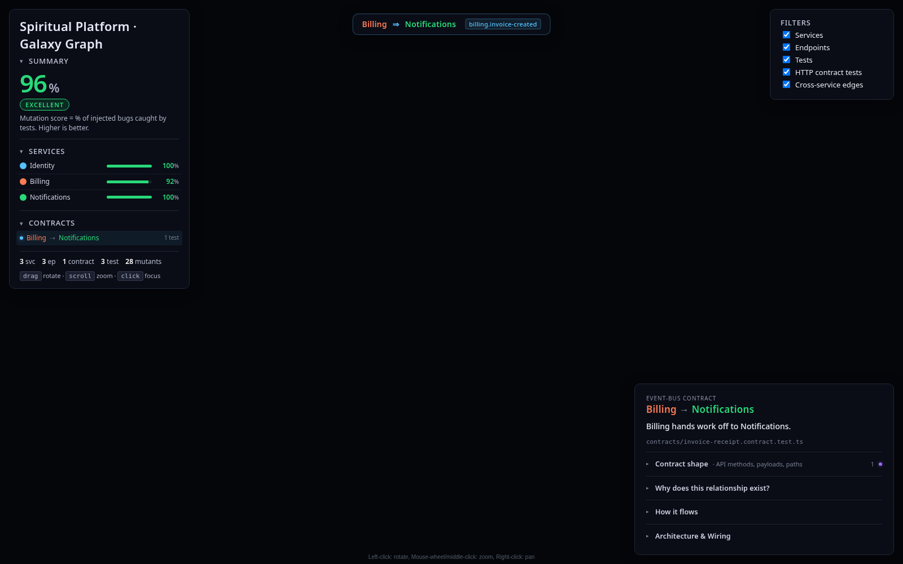
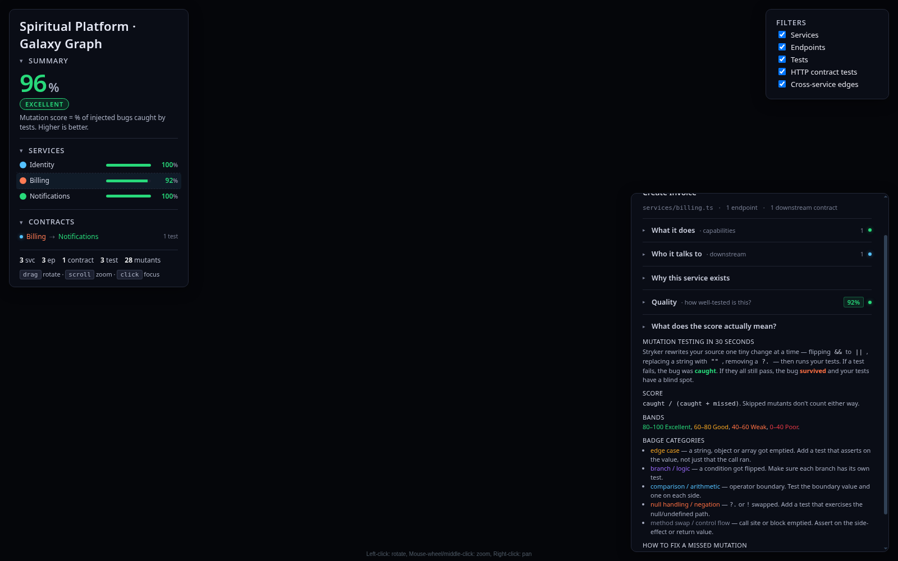

https://bensheridanedwards.github.io/spiritual-platform-galaxy-graph/

# Spiritual Platform · Galaxy Graph

Interactive 3D architecture + mutation-coverage map for **Spiritual Platform** (React + Three.js / `3d-force-graph`). Hosted on GitHub Pages (`gh-pages`).

Public-safe sample catalog (identity / billing / notifications). No backend secrets.

## What you are looking at

- **Services / endpoints / tests / contracts** as a navigable 3D galaxy
- **Mutation score** colour bands and survivor lists (Stryker-style mutation testing)
- **Coverage** of endpoints by tests; cross-service contract bonds (direct-call + event-bus topics)
- **Narratives** on nodes explain *why* a service/endpoint/test exists (documentation written beside the graph)

## Screenshots (from the live GitHub Pages deploy)

### 1. Why the tests matter (aspects)



**What it shows:** A test node InfoCard with its **aspect / category chip** (here: *Contract shape*), the story of *why* the test exists, and which endpoints it covers.  
**Why it matters:** Aspects turn “we have tests” into concrete product promises — contract shape, events, resilience — so you can see which guarantees are actually pinned.



**What it shows:** An *Event* aspect test on Billing that pins the invoice-created lifecycle signal.  
**Why it matters:** Cross-service behaviour is only safe when the event contract is locked the same way HTTP contracts are.

### 2. Stryker / mutation tests



**What it shows:** Per-service Quality panel: mutation score, caught / missed / skipped counts, endpoint breakdown, and the **Missed mutations** list (bugs Stryker injected that no test caught).  
**Why it matters:** Line coverage can be green while mutants survive. This panel shows the blind spots Stryker found — e.g. a branch flipped to `false` that still passed.



**What it shows:** In-panel DeepDive: how Stryker rewrites source, how the score is computed, badge categories (edge case, branch, comparison, null handling…), and how to fix a missed mutant.  
**Why it matters:** Readers learn the mutation vocabulary without leaving the graph.

### 3. Coverage


**What it shows:** Aggregate mutation score (96% Excellent), per-service bars, Mutation Score colour bands, service categories, edge legend, and visibility filters.  
**Why it matters:** Coverage at a glance — which services are excellent vs weak — before you dive into individual mutants or endpoints.



**What it shows:** Full live UI chrome: left metrics panel, right legend, centre canvas host.  
**Why it matters:** Confirms Spiritual Platform branding and the interactive shell on the public deploy URL.

### 4. How documentation gets written



**What it shows:** Service InfoCard toggles for **Why this service exists** and **How it works** (step-by-step flow) — narrative copy written next to the graph, not in a separate wiki.  
**Why it matters:** Architecture docs stay attached to the nodes they describe; clicking a service answers “what is this?” without leaving the viz.



**What it shows:** A cross-service contract InfoCard (Billing → Notifications via event-bus) with path, since, and prose explaining the product promise.  
**Why it matters:** Contracts are first-class documented bonds — the same place you see the rope in the galaxy is where the written explanation lives.

### 5. Explanations of all of the above



**What it shows:** **How to read this** (Caught / Missed / Skipped) plus the mutation DeepDive, alongside the live score bands and filters.  
**Why it matters:** One reading guide ties aspects, Stryker survivors, coverage bands, and narrative docs into a single mental model for the galaxy.

## Develop / build

```bash
npm ci
npm run dev    # local
npm run build  # static dist/
```

## Branding

- Product: **Spiritual Platform**
- Viz line: Verse Network Galaxy Graph
- This repo is the Spiritual / Verse host only.
