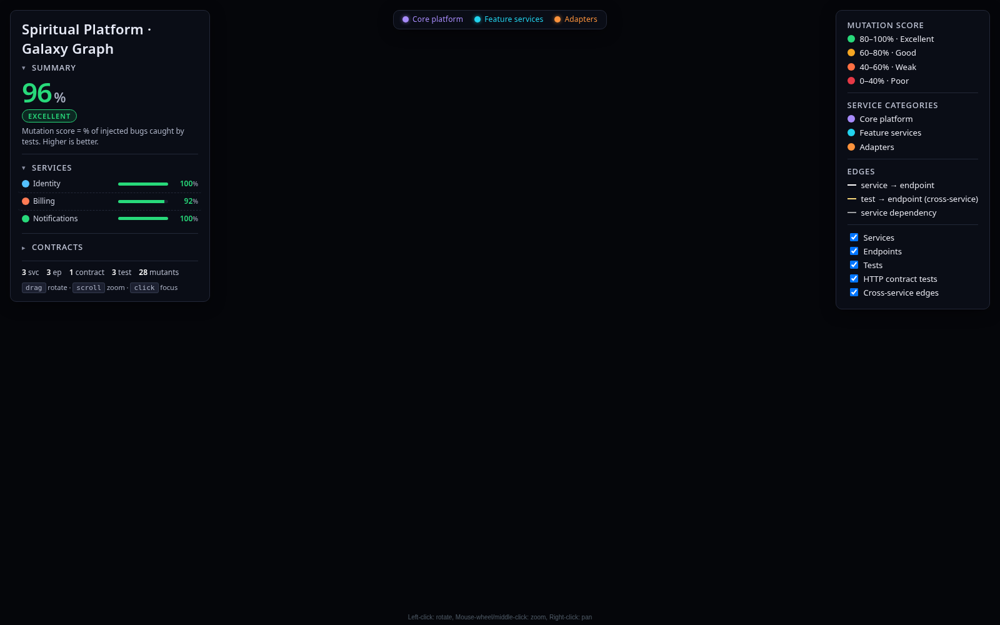

# Spiritual Platform · Galaxy Graph

> **Interactive deploy URL (headline):** https://bensheridanedwards.github.io/spiritual-platform-galaxy-graph/  
> Host: GitHub Pages (`gh-pages`) — default platform URL, no custom domain. Vercel `*.vercel.app` still optional once `VERCEL_TOKEN` is available.

Verse Network Galaxy Graph product line for **Spiritual Platform**. Interactive 3D architecture + mutation-coverage map (React + Three.js / `3d-force-graph`).

## What you are looking at

- **Services / endpoints / tests / contracts** as a navigable 3D galaxy  
- **Mutation score** colour bands and survivor lists (Stryker-style mutation testing)  
- **Coverage** of endpoints by tests; cross-service contract bonds (direct-call + event-bus topics)  
- **Narratives** on nodes explain *why* a service/endpoint/test exists (documentation written beside the graph)

Public-safe sample catalog (identity / billing / notifications). No backend secrets.

## Screenshots (local build proof — refresh after live URL)

### 1. Galaxy canvas + coverage header


**What it shows:** Aggregate mutation score, per-service bars, legend/filters.  
**Why it matters:** Coverage at a glance — which services are excellent vs weak before you dive into mutants.

### 2. Full UI chrome (panels + canvas)


**What it shows:** Left metrics panel, right legend, centre 3D canvas host.  
**Why it matters:** Confirms Spiritual Platform branding (no third-party company names) and the interactive shell ready for deploy.

### 3–5. Tests / Stryker / documentation (capture on live URL)

After the `*.vercel.app` link is live, add shots for:

| Shot | Aspect | Why it matters |
|---|---|---|
| Tests | Why tests matter (aspects / categories on test nodes & InfoCard) | Shows which product promises are pinned by contract/event/resilience tests |
| Stryker | Mutation testing DeepDive + survivor lists | Explains injected bugs caught vs missed (“striker” → Stryker) |
| Coverage | Score bands + endpoint rings | Maps test effectiveness onto architecture |
| Documentation | Narrative / DeepDive copy in-panel | How explanations are written next to the graph |
| Explanations | Status guide + legend | Ties the above into one reading guide |

## Develop / build

```bash
npm ci
npm run dev    # local
npm run build  # static dist/
```

## Branding

- Product: **Spiritual Platform**
- Viz line: Verse Network Galaxy Graph
- Separate from any other platform deploy; this repo is the Spiritual/Verse host only.
